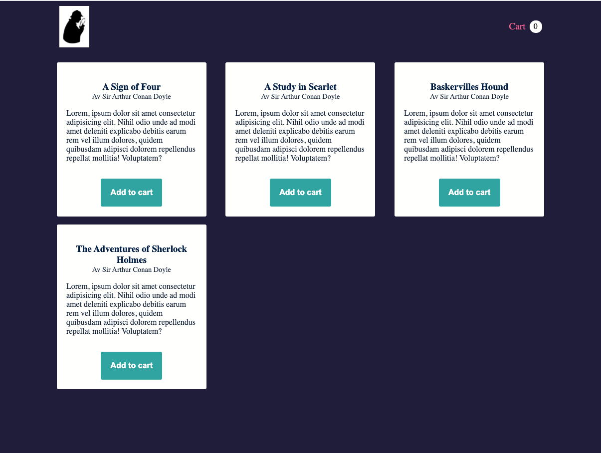
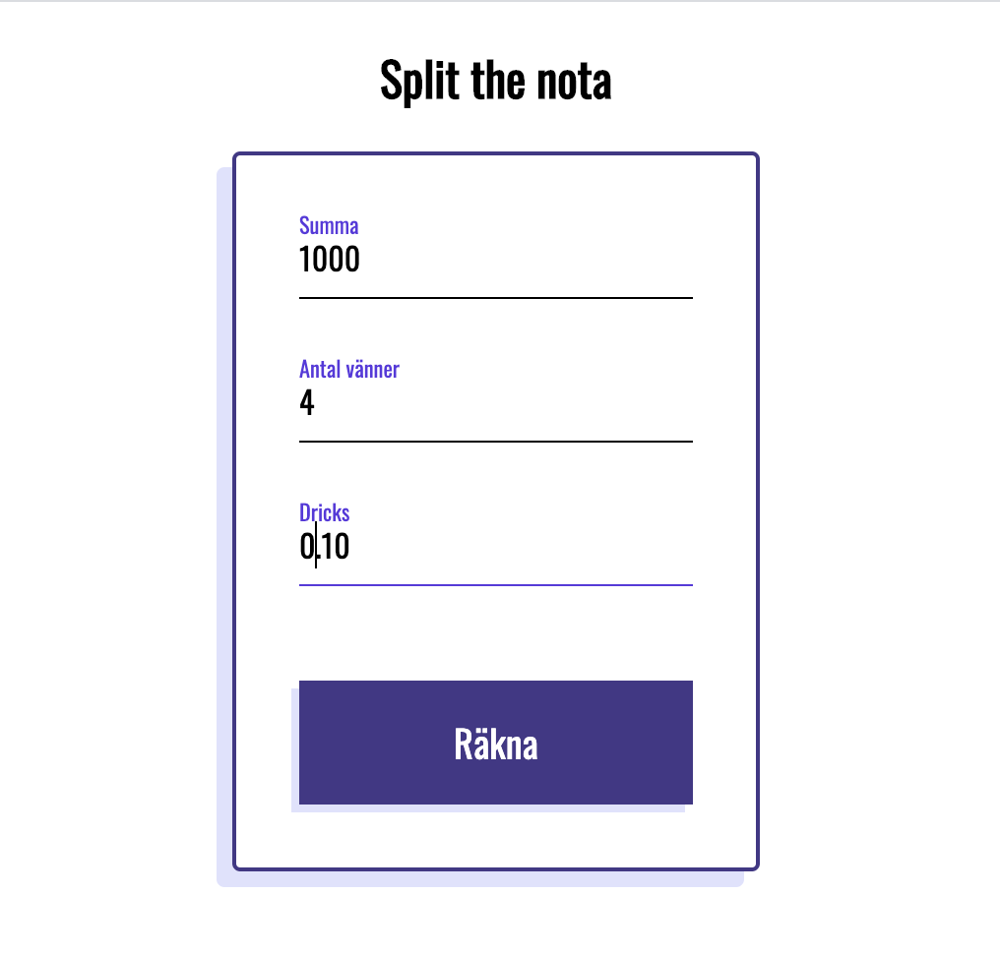

# Övningar

## Props

### Bokhandeln

I denna övning ska du göra en React-applikationen enligt designen som du kan se på bilden nedanför. Denna sida kommer i denna övning vara statisk d.v.s. du kan hårdkoda all information och knapparna etc behöver inte göra något. Vi kommer återvända till denna övning och fixa det framöver.

Följande komponenter bör finnas med:

- App
- Header
- Cart (som ligger i Header)
- Products
- Book

Använd er av ```books.json``` för data till era objekt. Välj själva vilka delar av objekten ni vill rendera ut. Skissen behöver naturligtvis inte följas, den är bara ett förslag.

#### Skiss


### Valfritt projekt

Skapa en valfri, egen applikation som använder sig av props. Det ligger .json-filer i assets med en massa materiel ni kan använda er utav.  

## Interaktivitet

### Bokningsformulär

Bygg din React-app enligt nedanstående Figmaskiss (hur mycket CSS du vill göra är upp till dig).

**Steg 1**

Koppla ihop varje datapunkt ( klass, titel, förnamn, efternamn, godkänner ) med en funktion i din React-komponent som lyssnar efter inmatning och sparar det som skrivs in i ett inputfält i en variabel.

**Steg 2**

Lyssna efter ett klickevent på knappen. Vid klick skall du skapa ett bokningsobjekt innehållandes informationen i dina variabler. Logga sedan ut ditt objekt i konsollen.

Figmaskiss: https://www.figma.com/file/XenjCcyq3pZUOa9MF3urqQ/Vue.js-form-exercise---Book-a-flight?node-id=0%3A1

### Split the nota

Split the nota räknar ut hur mycket varje vän ska betala på exempelvis en restaurang när notan kommer. Användaren matar in summan, antal vänner och sedan dricks (som skrivs i decimalform d.v.s 10% blir 0.10).
Lyssna efter ett klickevent på knappen. Den ska då console.logga vad varje person ska betala.

- Återskapa skissen nedan i din webbläsare
- Vid en onChange-händelse på dina input-fält skall en funktion anropas som sparar ner det nuvarande värdet i ditt inputfält i en variabel.
- Vid klickhändelse på knappen skall en funktion anropas som räknar ut hur mycket varje vän skall betala. Resultatet skall loggas ut i konsollen.

#### Skiss



## React Bootcamp
[I detta dokument](https://docs.google.com/document/d/15Ez_E2d3mh7NuDa60A3Lj-4rZZc52eN7I05PhYwtvk8/edit?usp=sharing) finner ni uppgifter som ni nu för kunna utföra (bortsett från den sista delan som innefattar useState vilket vi kommer till nästa vecka).

